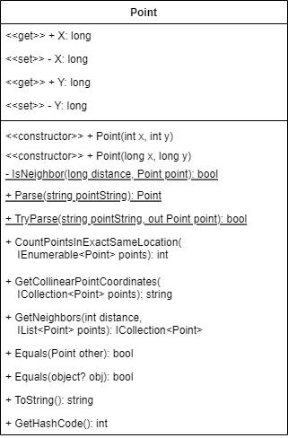
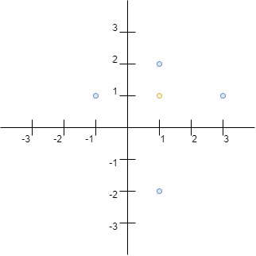
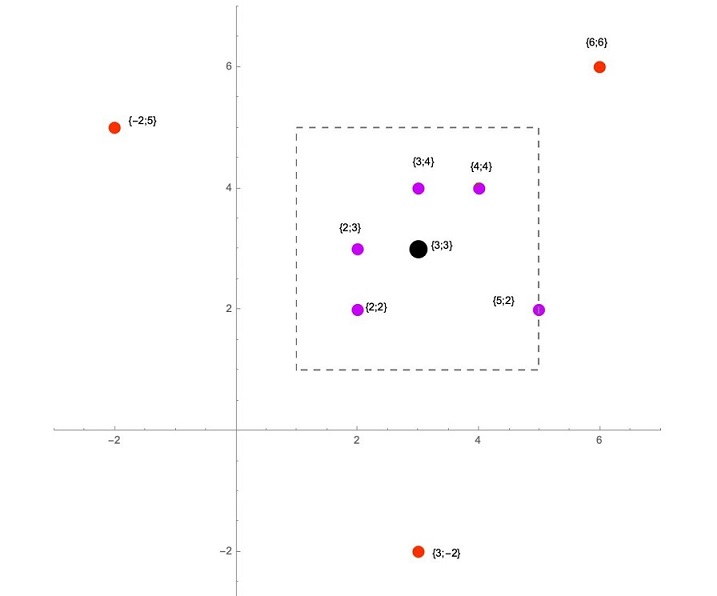

# Point Struct

Beginner level task for practicing structure types and struct declaration.

Before starting with the task learn the basics of [UML language](https://en.wikipedia.org/wiki/Unified_Modeling_Language) and [UML Class Diagrams](https://en.wikipedia.org/wiki/Class_diagram). Search YouTube for [relevant video tutorials](https://www.youtube.com/results?search_query=uml+class+diagram) to get started quickly. Don't waste time! You don't have to master class diagrams. You just need to get a [basic understanding on the topic](https://www.tutorialspoint.com/object_oriented_analysis_design/ooad_uml_basic_notation.htm), and you can always find the answer to your question in the [UML Class Diagrams Reference](https://www.uml-diagrams.org/class-reference.html).

Estimated time to complete the task - 1h.

The task requires .NET 6 SDK installed.

## Task Description

In this task you have to implement a [structure type](https://docs.microsoft.com/en-us/dotnet/csharp/language-reference/builtin-types/struct) that represents a point in the [Cartesian coordinate system](https://en.wikipedia.org/wiki/Cartesian_coordinate_system).

Add a new [public](https://docs.microsoft.com/en-us/dotnet/csharp/programming-guide/classes-and-structs/access-modifiers) struct to the [Point.cs](PointStruct/Point.cs) file. The class must fulfill these requirements:
* The struct must have the same name as the file name.
* The struct must be [immutable](https://en.wikipedia.org/wiki/Immutable_object).
* Static Methods
    * The struct must have the public `Parse` method to parse a string representing a `Point` structure. The method must return the new object of the `Point` type that must be initialized with the values from a specified string. The method must throw an `ArgumentException` if the method is not able to parse a string. See the string format in the [Parse_ReturnsPoint](PointStruct.Tests/PointTests.cs#L277) unit test.
    * The struct must have the public `TryParse` method to parse a string representing a `Point` structure. The method should follow the [Try-Parse Pattern](https://docs.microsoft.com/en-us/dotnet/standard/design-guidelines/exceptions-and-performance#try-parse-pattern) rules.
* Properties
    * The class must have the public `X` and `Y` properties to store a point coordinates. Both properties must have the public [get accessor](https://docs.microsoft.com/en-us/dotnet/csharp/programming-guide/classes-and-structs/using-properties#the-get-accessor) and the private [set accessor](https://learn.microsoft.com/en-us/dotnet/csharp/programming-guide/classes-and-structs/using-properties#the-set-accessor).
* Constructors
    * The struct must have two public [constructors](https://docs.microsoft.com/en-us/dotnet/csharp/programming-guide/classes-and-structs/constructors) with `x` and `y` parameters that must initialize the struct properties with the given arguments.
    * The struct must have a constructor with `int` parameters.
    * The struct must have a constructor with `long` parameters.
    * To remove the code duplication, use the [constructor chaining](https://www.google.com/search?q=constructor+chaining+c%23) approach.
* Instance methods
    * The struct must have the `CountPointsInExactSameLocation` method. The method must return a number of points that exact same coordinates.
        * Use the overloaded equality operator to compare two `Point` objects.
    * The struct must have the `GetCollinearPointCoordinates` method.
        * See the description for the `GetCollinearPointCoordinates` method for more details.
    * The struct must have the `GetNeighbors` method.
        * See the description for the `GetNeighbors` method for more details.
    * The struct must override the `ToString` method to return the string representation of `Point` object.
        * Concatenate the values of the `X` and `Y` properties: (123,456) => "123,456".
        * See the examples of the result string in the [ToString_ReturnsString](PointStruct.Tests/PointTests.cs#L346) unit test.
* Define the [value equality](https://docs.microsoft.com/en-us/dotnet/csharp/programming-guide/statements-expressions-operators/how-to-define-value-equality-for-a-type) for the struct:
    * The struct must implement the [IEquatable&lt;T&gt;](https://docs.microsoft.com/en-us/dotnet/api/system.iequatable-1) interface.
    * The struct must have the public `Equals(Point other)` method to determine whether the specified `Point` object is equal to the current object.
    * The struct must override the [Equals(object? obj)](https://docs.microsoft.com/en-us/dotnet/api/system.object.equals) method to determine whether the specified object is equal to the current object. The method argument can be `null` or be of another type.
    * The struct must [overload](https://docs.microsoft.com/en-us/dotnet/csharp/language-reference/operators/operator-overloading) the [equality operator ==](https://docs.microsoft.com/en-us/dotnet/csharp/language-reference/operators/equality-operators#equality-operator-).
    * The struct must overload the [inequality operator !=](https://docs.microsoft.com/en-us/dotnet/csharp/language-reference/operators/equality-operators#inequality-operator-).
    * The struct must override the [GetHashCode](https://docs.microsoft.com/en-us/dotnet/api/system.object.gethashcode) method that must return the object hash code.
        * See the description for the `GetHashCode` method for more details.

### The GetCollinearPointCoordinates Method

The `GetCollinearPointCoordinates` must return a string that represents a list of points that are collinear to a point that is represented by a `Point` object.

Collinear points in this task are the points that have at least one same coordinate as the point represented by a `Point` object (original object).

The points (1,2), (3,1), (-1,1) and (1,-2) are collinear to the (1,1) point.

The result string must contain the coordinates of collinear points as well as the name of the axis of a coordinate that is the same for an original point. The point that has the same coordinates as the original point must be marked with the `"SAME"` text.

Example:

`(1,2,"X"),(3,1,"Y"),(-1,1,"Y"),(1,-2,"X"),(1,1,"SAME")`

### The GetNeighbors Method

The method must return a collection of points that are distance-neighbors for the original point. The method must use the private `IsNeighbor` method to determine whether a point is a neighbor.

If the distance is 2, the points (2,2), (2,3), (3,4), (4,4) and (5,2) are neighbors of the (3,3) point.

### The GetHashCode Method

The `GetHashCode` method must calculate the object's hash code:

1. Use the [binary logical and shift operators](https://learn.microsoft.com/en-us/dotnet/csharp/language-reference/operators/bitwise-and-shift-operators) to extract 32-bit values of the `long` values.
2. Use the logical exclusive OR operator to compute the bitwise logical exclusive OR of values.

Example:

|   | Decimal value       | Hexadecimal value  | v1          | v2          | v1 XOR v2  |
|---|---------------------|--------------------|-------------|-------------|------------|
| X | 578437695752307201  | 0x0807060504030201 | 0x04030201  | 0x08070605  | 0x0c040404 |
| Y | 3255024090559027994 | 0x2D2C2B2A1D1C1B1A | 0x1D1C1B1A  | 0x2D2C2B2A  | 0x30303030 |

The result hash is `0x0c040404 XOR 0x30303030 = 0x3c343434`.
